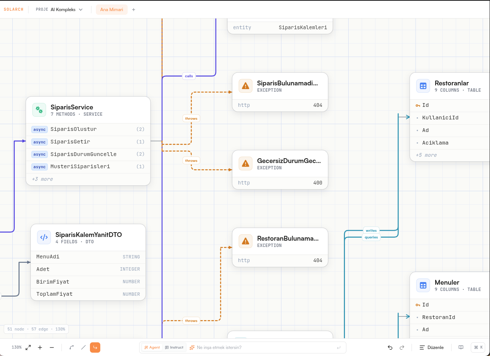
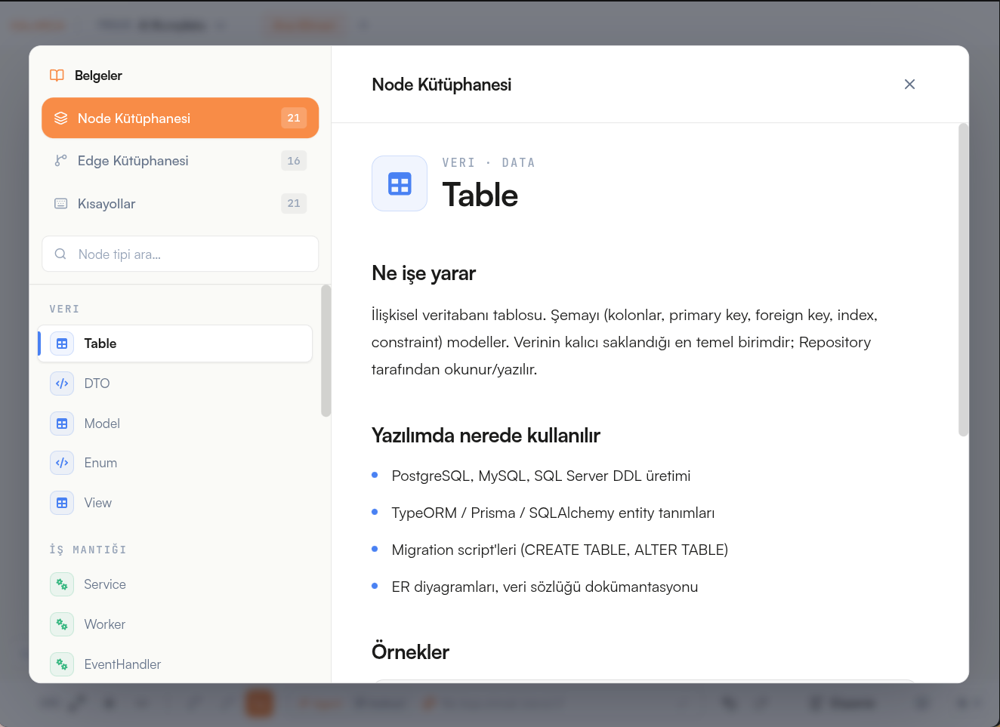

  
  <h1>SOLARCH</h1>
  <h3>AI-Powered Architectural Pipeline & Agentic DevTool</h3>

   
  
  

    

  

  

    
    
    
  

  
<em>Bridging diagrams and code via a strict rules engine to stop AI errors.</em>

 

  

---

## WHAT IS SOLARCH?

**Solarch** is an autonomous architectural coding platform designed for software teams, CTOs, and agencies. At its core, Solarch acts as the definitive bridge between visual architecture and generated code. Traditional AI coding assistants write code line-by-line, often losing sight of the bigger picture. Solarch, instead, operates through a strict rules engine that ensures every line of generated code perfectly aligns with your initial diagram.

By bridging diagrams directly to the codebase via deterministically enforced rules, Solarch completely stops AI hallucinations, logic drifts, and structural errors before they even reach your repository. Say goodbye to spaghetti code and hello to **Zero Architectural Drift**.

---

## CORE PHILOSOPHY

### The Bridge: From Diagram to Code
Solarch's central thesis is that the diagram *is* the code contract. Our strict rules engine acts as the immutable bridge between your visual intent and the LLM's output. If the AI proposes a change that violates the diagram's logic, the rules engine blocks it instantly.

### Zero Architectural Drift
AI shouldn't code blindly. Because of the bridge, the code *must* strictly follow the visual architectural diagram (Single Source of Truth). Every component generated matches the blueprint precisely.

### State-Based Generation
We don't build the entire project with one massive, expensive prompt. Every module is generated step-by-step. The AI presents the Diff, and code is never merged into the repository without your explicit **Approval**. This chunking strategy ensures massive token cost optimization and surgical precision.

---

## FEATURES

### Agentic Pipeline Builder
Plan the exact sequence of tasks your AI agents will execute with a clean, Bauhaus-inspired visual node interface. 

> `[Read Diagram] ➔ [Write FastAPI Route] ➔ [Add DB Migration] ➔ [Write Pytest] ➔ [Isolated Test] ➔ [Git Commit]`

  

 

### Architecture Time Travel
Because Solarch is **State-Based**, every approved step is saved as a Snapshot. Need to revert? Drag the timeline back, and instantly rollback your diagram, database schema, and code blocks to a previous stable state.

### Autonomous Quality Control
- **Auto-Pentest (Red Team Agent):** Spawns in an isolated sandbox after code generation. It autonomously attacks your API endpoints (SQL Injection, Rate Limiting). If it finds a vulnerability, it rejects the code and patches it itself.
- **Architectural Gatekeeper:** Prevents team members from opening Pull Requests that deviate from the visual diagram.

---

## TECHNICAL DEPTH

Solarch is built to scale, capable of handling high loads (50,000 RPM) with a modern, monolithic-yet-scalable architecture:

- **Frontend:** Vite 8, React 19, and our hyper-optimized, **60fps Custom Canvas 2D Engine** (bypassing the DOM entirely for massive node rendering). Includes a fully-typed OpenAPI client and strict Rules Engine interactions.
- **Backend:** NestJS 11, Neo4j (Graph DB + Native Vector Index), DeepSeek v4-flash, and a powerful graph mutation/rules engine.
- **AI & RAG:** Seamlessly integrates GraphRAG, local MiniLM embeddings (`@xenova/transformers`), and top-tier LLMs for zero-hallucination natural language architecture generation.

---

## HOW IT WORKS (AI WORKFLOW)

Just talk to the Omni-Bar.

  

1. **Instruct in Natural Language:** Start by describing your desired architecture.
2. **Vector Search (GraphRAG):** The system searches the canonical pattern library using Neo4j vector indexing.
3. **LLM Generation:** DeepSeek structures the JSON output perfectly aligned with the graph schema.
4. **Atomic DB Commit:** The visual graph is dynamically rendered and safely committed via the Rules Engine with automated self-correction loops.

---

## ACCESS SOLARCH

No local installation or complex setup is required. Solarch is a fully managed cloud platform.

You can access your virtual engineering team directly at:

  <h3><a href="https://solarch.dev">www.solarch.dev</a></h3>

---

  <strong>Built with precision by the Solarch Team.</strong>  
  <a href="https://github.com/solarch/solarch/issues">Report an Issue</a> &nbsp;&middot;&nbsp; <a href="https://twitter.com/solarch">Follow our Updates</a>

