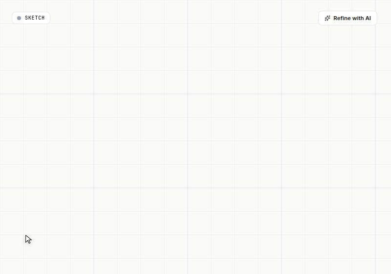
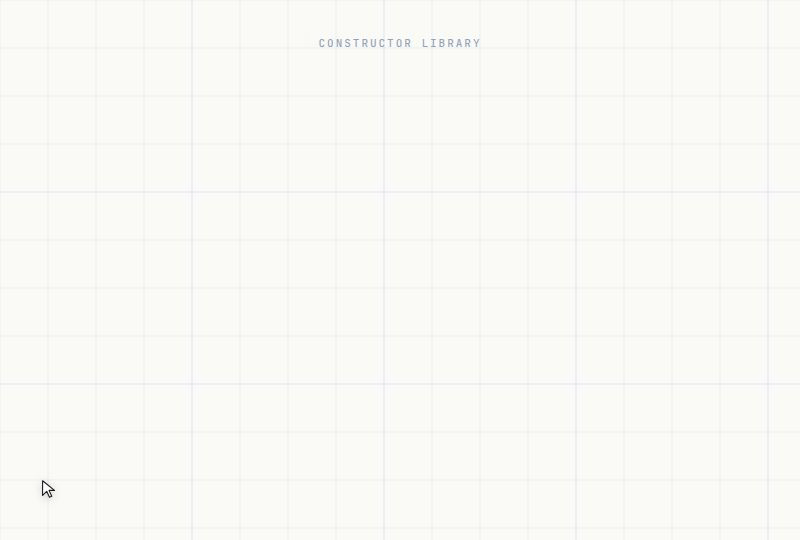

<h1>Solarch</h1>

<h3>AI-Powered Architectural Pipeline & Agentic DevTool</h3>

  
  
  

    
  

  

<strong>Your entire workspace, on one canvas.</strong> &nbsp;|&nbsp; AI that ships. No more hallucinations.

[**Why Solarch?**](#why-solarch) |
[**Screenshots & Gifs**](#screenshots--gifs) |
[**Features**](#features) |
[**The Philosophy**](#the-philosophy) |
[**Get Involved**](#get-involved)

## Why Solarch?

Most AI tools hallucinate code and hope the architecture catches up. Solarch flips that.

It writes **architecture** first — a structured, navigable, editable graph of your system — and only invokes AI where AI actually adds value: the algorithm, not the API surface.

Solarch provides:

- **One canvas for the whole system** — controllers, services, repositories, tables, DTOs, and the semantic edges between them
- A **sketch-to-architecture** pipeline — draw freehand, hit Refine, get a structured graph
- **Constructors** — opinionated, pre-wired patterns (auth, CRUD, event pipelines) that ship 80% of your structure on click
- **Surgical AI** — algorithm-only completion in the remaining 20%; no hallucinated APIs, no fabricated endpoints
- **First-class semantic edges** — *calls*, *queries*, *publishes*, *subscribes*, *throws* — visualized natively, not generic arrows
- **Per-type editors** — tables get column grids, services get method tables, controllers get endpoint rows
- A live **Instruct mode** — chat with your architecture; every answer cites the exact nodes it references and focuses the canvas

## Screenshots & Gifs

**Start with a prompt — or a sketch**

  

A prompt. A scribble. A half-formed idea. Solarch meets you where you are. Type what you want to build — the architecture forms in front of you.

  

Draw it on a napkin instead. Hit **Refine**. Your sketch becomes a structured architecture in seconds — same canvas, same model, no translation tax.

**Watch architecture build itself**

  

One prompt. Layered architecture. Nodes appear with zen pop animations, edges flow with the right semantics — **calls**, **uses**, **queries** — labeled, colored, and wired with intent. The whole shape, in one shot.

**A library of constructors**

  

One click expands an entire pattern: nodes, edges, methods, types — all wired. No starting from a blank canvas. **Templates that ship**, not stubs you have to finish.

**Connect anything to anything**

  

Hover a port, drag, snap. Semantic relationships are first-class citizens — every edge carries meaning your architecture can reason about.

**Every node, fully editable**

  

Double-click any node. Methods, fields, types, validation rules, dependencies — edit inline with a contextual inspector. No generic JSON forms.

**Ask your architecture anything**

  

Switch to **Instruct** mode and chat with your design. Every answer cites the nodes it references — and every citation is a live chip that focuses the canvas with a soft halo. Your architecture explains itself, in your own canvas, in real time.

## Features

- **Three-mode pipeline** — `Sketch` → `Refine` → `Generate`, all on a single canonical model
- **Native SVG sketch surface** — freehand, stencils, frames, multi-tab workspace
- **AI-driven refine** — LangGraph + DeepSeek transforms sketches into structured graphs with parallel node + edge inference
- **21 first-class node families** — Table, DTO, Model, Service, Worker, Controller, APIGateway, Repository, Cache, Middleware, FrontendApp, UIComponent, MessageQueue, EventHandler, Orchestrator, Module, and more
- **16 semantic edge kinds** — `CALLS`, `QUERIES`, `WRITES`, `PUBLISHES`, `SUBSCRIBES`, `USES`, `HAS`, `RETURNS`, `EXTENDS`, `IMPLEMENTS`, `THROWS`, `READS_CONFIG`, `ROUTES_TO`, `DEPENDS_ON`, `CACHES_IN`, `REQUESTS`
- **Constructor library** — one-click expansion into fully-wired node groups (auth, CRUD, event pipelines)
- **Purpose-built inspectors** — column grids for tables, method tables for services, endpoint rows for controllers, validation rule lists for DTOs
- **Instruct mode** — Q&A over your architecture with live node chips, sequential focus halos, and per-turn context
- **Edge bundling & semantic routing** — obstacle-aware elbow + bezier paths, three render modes per project
- **Multi-tab workspace** — break complex systems into focused frames; promote sketch frames to canvas tabs
- **Mermaid export** — every graph round-trips as Mermaid for docs, code review, and external tooling
- **Local-first persistence** — your project is a canonical model; AI is a tool, never the source of truth
- **Aydınlık Blueprint design language** — paper zemin, semantic family colors, hairline grid, Satoshi + JetBrains Mono typography

## The Philosophy

**Solarch doesn't write code. It writes architecture.**

The industry has spent two years trying to make LLMs write code. The result: confident hallucinations, ghost APIs, and codebases that compile but lie. The hallucination isn't a tuning problem — it's a category error.

Architecture is the level where structure is **provable**. A controller calls a service. A service queries a repository. A repository writes a table. These relationships are either present or not. They can't be hallucinated.

So Solarch separates the two concerns:

- **Constructors** — deterministic, hand-authored, pre-wired patterns that ship the structural 80% of any backend. Auth flows, CRUD slabs, event pipelines, validation chains. No AI, no generation, no risk. Just composition.
- **Surgical AI** — invoked only inside the algorithmic 20%. A specific business rule. An edge case in validation. The pricing curve. The retry policy. Where AI genuinely earns its keep — and where determinism is impossible anyway.

Predictable structure. Targeted intelligence. Zero hallucinated APIs.

## See. Understand. Plan.

In one shot.

## Get Involved

- [GitHub Discussions](https://github.com/fatalerrorist/Solarch/discussions) — feature requests, design feedback, questions
- [Issues](https://github.com/fatalerrorist/Solarch/issues) — bug reports, regressions
- [Contributing Guide](./CONTRIBUTING.md) — local setup, conventions, commit style
- Star the repo to follow along

## License

[PolyForm Noncommercial License 1.0.0](./LICENSE) — © 2025 Ugur Akdogan.

**Free** for personal use, research, education, and non-profit organizations. Source is open: fork, learn, modify, share — go for it. **Commercial use requires a separate license** — reach out at [info@solidea.tech](mailto:info@solidea.tech).

---

<strong>Solarch.</strong>

